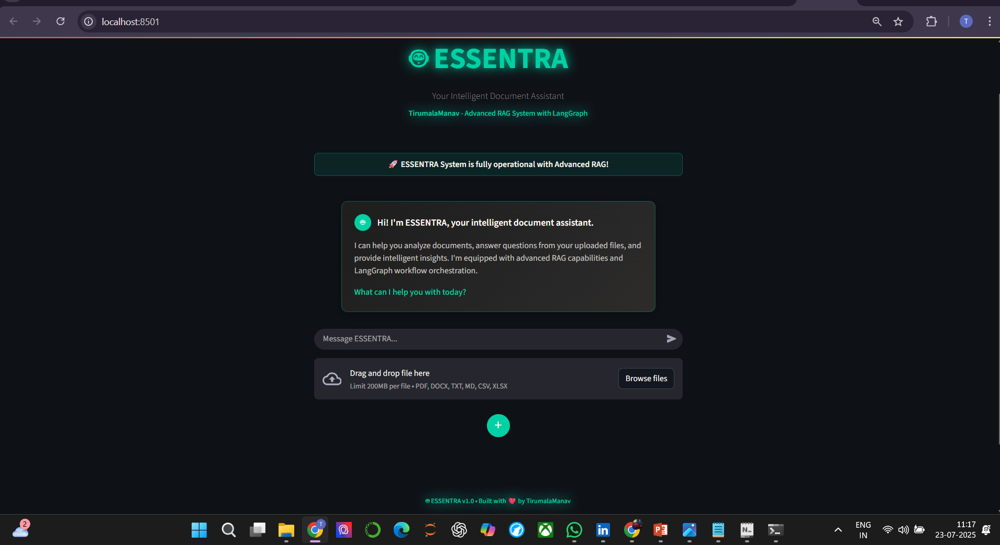
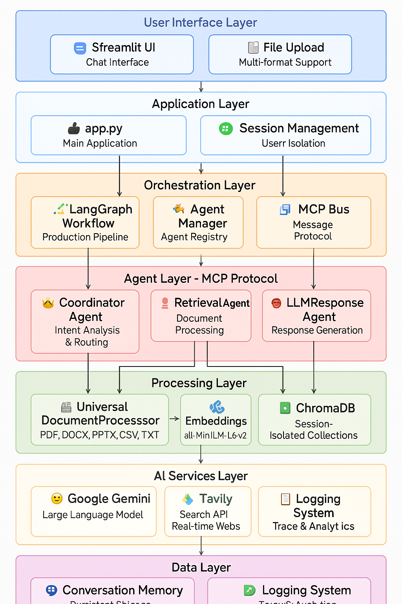
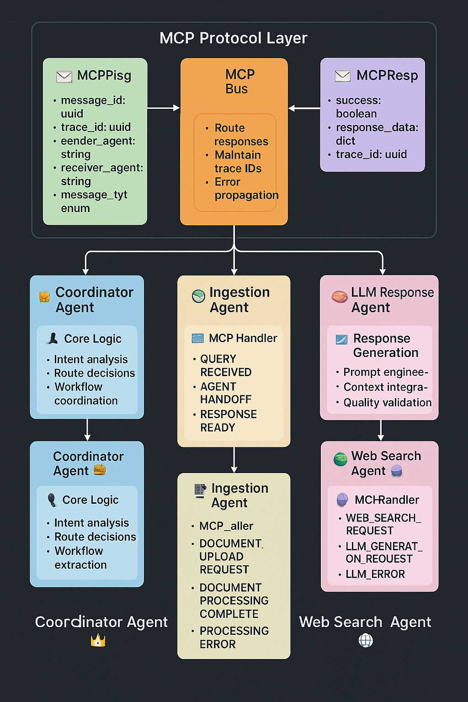
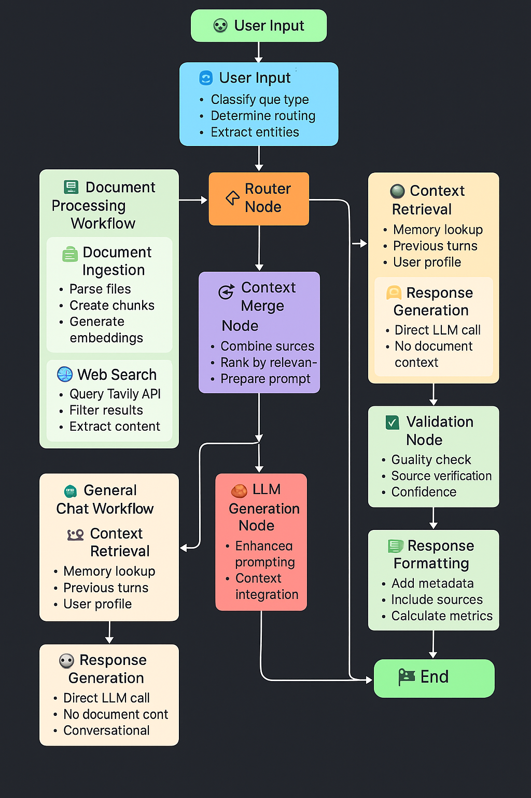
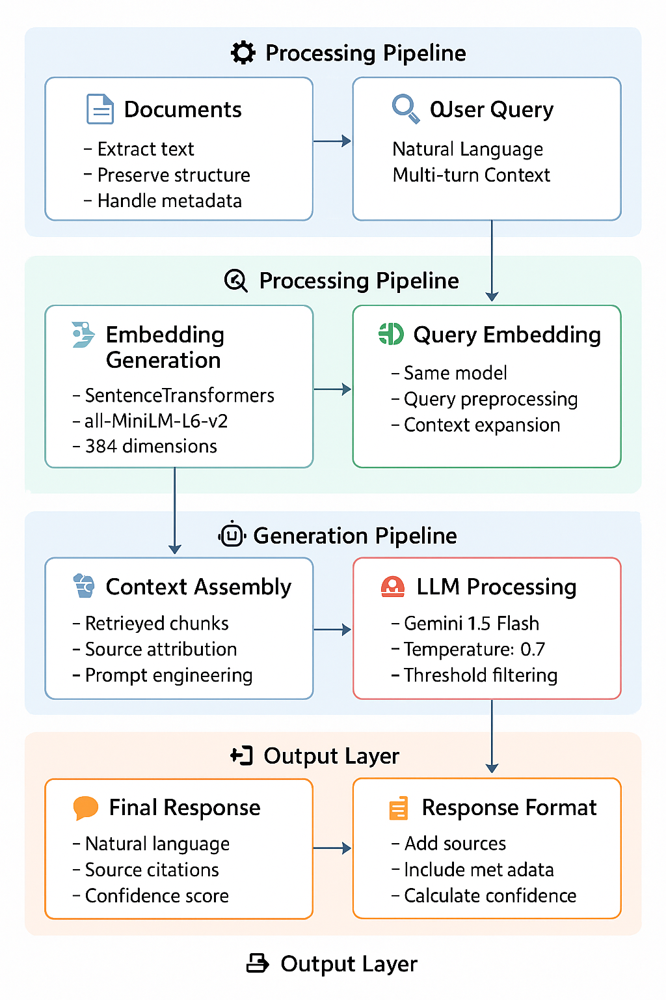

# 🤖 ESSENTRA - Advanced Agentic RAG Chatbot

<div align="center">



**Intelligent Multi-Agent Document Processing System with Model Context Protocol**

[](https://python.org)
[](https://streamlit.io)
[](https://langchain.com)
[](LICENSE)

</div>

---

## 🌟 Overview

**ESSENTRA** is an advanced Retrieval-Augmented Generation (RAG) chatbot that implements a sophisticated multi-agent architecture with Model Context Protocol (MCP) for intelligent document processing and question answering. Built with enterprise-grade technologies, ESSENTRA delivers production-ready performance with seamless user experience.

### ✨ What makes ESSENTRA special?

ESSENTRA combines cutting-edge AI technologies with enterprise-grade architecture to deliver an unparalleled document intelligence experience. Our multi-agent system processes documents in real-time while maintaining session isolation and providing contextual responses with source citations.

## 🎯 Features

### 🤖 Multi-Agent Architecture
- **CoordinatorAgent**: Intent analysis and intelligent request routing
- **IngestionAgent**: Multi-format document parsing and preprocessing
- **RetrievalAgent**: Semantic search with context ranking
- **LLMResponseAgent**: Advanced response generation with Gemini 1.5 Flash
- **WebSearchAgent**: Real-time web information retrieval via Tavily API

### 🧠Processing Pipeline
- **LangGraph Orchestration**: Production-ready workflow management
- **MCP Protocol**: Structured inter-agent communication with trace IDs
- **Vector Database**: ChromaDB with session-isolated collections
- **Smart Chunking**: Context-aware text segmentation with overlap
- **Session Management**: Persistent conversation memory

### 📄 Document Support
- **Multi-Format Processing**: PDF, DOCX, PPTX, CSV, TXT, and Markdown support
- **Real-Time Processing**: Async operations with progress indicators
- **Intelligent Parsing**: Context-aware document structure recognition

### 🔧 Enterprise Features
- **Production Ready**: Comprehensive error handling and monitoring
- **Session Isolation**: Multi-user support with secure data separation
- **Performance Optimized**: Async processing and smart caching
- **Professional UI**: ChatGPT-like interface with modern design

## ⚡ Quick Start

### Prerequisites

- Python 3.8 or higher
- Gmail account for API access
- Internet connection for API calls

### Installation

1. **Clone the repository**
   ```bash
   git clone https://github.com/TirumalaManav/essentra-ai
   cd essentra-ai
   ```

2. **Set up virtual environment**
   ```bash
   python -m venv venv
   source venv/bin/activate  # Windows: venv\Scripts\activate
   pip install -r requirements.txt
   ```

3. **Configure API keys**

   Get your API keys:
   - **Google Gemini API**: Visit [Google AI Studio](https://makersuite.google.com/app/apikey), sign in with Gmail, create new API key
   - **Tavily Search API**: Visit [Tavily](https://tavily.com), sign up with Gmail, get API key from dashboard

   Create `.env` file:
   ```bash
   GEMINI_API_KEY=your_gemini_api_key_here
   TAVILY_API_KEY=your_tavily_api_key_here
   USER_NAME=YOUR_NAME
   ```

4. **Launch the application**
   ```bash
   streamlit run app.py
   ```

5. **Access the interface**

   Open [http://localhost:8501](http://localhost:8501) in your browser

### Basic Usage

1. **Upload Documents**: Drag and drop or browse to upload PDF, DOCX, PPTX, CSV, TXT, or Markdown files
2. **Ask Questions**: Type your questions about the uploaded documents
3. **Get Intelligent Responses**: Receive contextual answers with source citations and confidence scores
4. **Web Search**: Ask questions that require real-time information for comprehensive answers

## 🏗️ Architecture

### System Overview

<div align="center">

</div>

ESSENTRA follows a layered architecture with clear separation of concerns:

- **User Interface Layer**: Streamlit-based chat interface with file upload
- **Application Layer**: Main application logic and session management
- **Orchestration Layer**: LangGraph workflow and MCP message bus
- **Agent Layer**: Five specialized agents for different processing tasks
- **Processing Layer**: Document parsing and vector storage
- **AI Services**: LLM and web search integration

### MCP Protocol Implementation

<div align="center">

</div>

The Model Context Protocol enables structured communication between agents:

- **Standardized Messages**: UUID-based message and trace identification
- **Error Propagation**: Graceful failure handling across agents
- **Performance Tracking**: Processing time monitoring
- **Scalable Design**: Stateless agent architecture

### LangGraph Workflow

<div align="center">

</div>

Intelligent workflow orchestration with conditional routing:

- **Intent Analysis**: Query classification and entity extraction
- **Dynamic Routing**: Document, web search, or chat workflows
- **Context Merging**: Multi-source information integration
- **Response Validation**: Quality assurance and confidence scoring

### Data Processing Pipeline

<div align="center">

</div>

End-to-end document processing with optimization:

- **Multi-Format Parsing**: Universal document processor
- **Embedding Generation**: Sentence Transformers with 384 dimensions
- **Vector Storage**: Session-isolated ChromaDB collections
- **Semantic Retrieval**: Cosine similarity with relevance ranking

## 🔧 Technology Stack

| Component | Technology | Purpose |
|-----------|------------|---------|
| **Frontend** | Streamlit | Interactive web interface |
| **Orchestration** | LangGraph | Workflow management |
| **Communication** | Custom MCP | Inter-agent messaging |
| **LLM** | Google Gemini 1.5 Flash | Response generation |
| **Web Search** | Tavily API | Real-time information |
| **Vector DB** | ChromaDB | Semantic search |
| **Embeddings** | Sentence Transformers | Text vectorization |
| **Document Processing** | PyPDF2, python-docx, python-pptx | Multi-format support |

## 📁 Project Structure

```
ESSENTRA/
├── app.py                          # Main application entry point
├── requirements.txt                # Python dependencies
├── .env                           # Environment configuration
├── .gitignore                     # Git ignore rules
├── LICENSE                        # MIT license
├── README.md                      # Project documentation
├── AUTHOR                         # Developer information
│
├── assets/                        # Architecture diagrams and screenshots
│   ├── Data Processing.png
│   ├── Langgraph WorkFlow.png
│   ├── MCP Message Flow.png
│   ├── System Architecture.png
│   └── UI Interface.png
│
├── src/                          # Core source code
│   ├── __init__.py
│   ├── agents.py                 # Multi-agent system with MCP
│   ├── config.py                 # Configuration management
│   ├── document_processor.py     # Multi-format document processing
│   ├── langgraph_workflow.py     # Workflow orchestration
│   ├── llm_clients.py           # LLM and API clients
│   ├── memory.py                # Conversation memory system
│   └── ui_components.py         # UI helper functions
│
├── tests/                        # Comprehensive test suite
│   ├── test_agents.py
│   ├── test_config.py
│   ├── test_document_processor.py
│   ├── test_langgraph_workflow.py
│   ├── test_llm_clients.py
│   ├── test_memory.py
│   └── test_ui_components.py
│
├── sample_data/                  # Sample documents for testing
│   ├── 1.docx                   # Sample Word document
│   ├── 2.xlsx                   # Sample Excel file
│   ├── 3.pdf                    # Sample PDF document
│   ├── 4.docx                   # Additional Word doc
│   ├── 5.csv                    # Sample CSV data
│   ├── 6.pptx                   # Sample PowerPoint
│   ├── 7.csv                    # Additional CSV
│   ├── 8.doc                    # Legacy Word format
│   ├── 9.pdf                    # Additional PDF
│   ├── 10.ppt                   # Legacy PowerPoint
│   └── 11.txt                   # Plain text file
│
├── data/                        # Persistent data storage
│   ├── chroma_db/              # ChromaDB storage
│   ├── memory/                 # Conversation memory
│   ├── uploads/                # Temporary uploads
│   ├── vector_db/              # Vector database
│   └── vector_store/           # Vector storage
│
└── temp/                        # Temporary file processing
```

## 💡 Usage Examples

### Document Intelligence
```python
# Upload documents and ask questions
1. Upload PDF, DOCX, PPTX, CSV, TXT, or Markdown files
2. Ask: "What are the key findings in this quarterly report?"
3. Get contextual responses with source citations and confidence scores
```

### Multi-Source Queries
```python
# Combine document analysis with web search
"Compare the sales data in my uploaded report with current market trends"

# Get comprehensive answers with multiple sources
```

### Analytics and Insights
```python
# Advanced document analysis
"Summarize the risk factors mentioned across all uploaded documents"
```

## 🚀 Live Demo

**Application URL**: [ESSENTRA Live Demo](https://drive.google.com/file/d/1rJ2cJ3qVx5Gpd57WmfJ04GWWfdcRjN4R/view?usp=drive_link)


Access the application directly through any web browser on desktop or mobile devices.

## 📈 Performance

### Optimization Features
- **Async Processing**: Non-blocking operations
- **Smart Caching**: Reduced API calls and faster responses
- **Resource Management**: Automatic cleanup and memory optimization
- **Load Balancing**: Ready for horizontal scaling

## 🛡️ Security & Privacy

### Data Protection
- **Session Isolation**: User-specific vector collections
- **API Security**: Secure credential management
- **No Data Persistence**: Documents processed temporarily
- **Privacy First**: No permanent storage of user data

### Safety Mechanisms
- **Input Validation**: Comprehensive file and query sanitization
- **Error Isolation**: Graceful failure handling
- **Rate Limiting**: API abuse prevention
- **Audit Logging**: Security event tracking

## 🧪 Testing

Run the comprehensive test suite:

```bash
# Run all tests
python -m pytest tests/ -v

# Run specific test module
python -m pytest tests/test_agents.py -v

# Run with coverage report
python -m pytest tests/ --cov=src --cov-report=html
```

## ⚙️ Configuration

### Environment Variables
```bash
# Required Configuration
GEMINI_API_KEY=your_gemini_api_key_here
TAVILY_API_KEY=your_tavily_api_key_here
USER_NAME=YOUR_NAME

# Optional Configuration
COMPETITION_MODE=true
LOG_LEVEL=INFO
MAX_FILE_SIZE=50MB
CHUNK_SIZE=500
CHUNK_OVERLAP=50
VECTOR_DB_PATH=./data/vector_store
MEMORY_PATH=./data/memory
```

### Performance Tuning
```python
# RAG Pipeline Configuration
RAG_CONFIG = {
    "chunk_size": 500,               # Optimal chunk size
    "chunk_overlap": 50,             # Context preservation
    "similarity_threshold": 0.75,    # Retrieval quality
    "max_retrieved_docs": 5,         # Performance balance
    "embedding_model": "all-MiniLM-L6-v2"
}

# Agent Configuration
AGENT_CONFIG = {
    "temperature": 0.7,              # Response creativity
    "max_tokens": 2048,              # Response length
    "timeout": 30,                   # Processing timeout
    "retry_attempts": 3              # Error recovery
}
```

## 🚀 Deployment

### Streamlit Cloud Deployment

1. **Push to GitHub**
   ```bash
   git add .
   git commit -m "Deploy ESSENTRA v1.0"
   git push origin main
   ```

2. **Configure Streamlit Cloud**
   - Connect repository at [share.streamlit.io](https://share.streamlit.io)
   - Add secrets for API keys
   - Auto-deploy on commits

3. **Environment Secrets**
   ```toml
   [secrets]
   GEMINI_API_KEY = "your_gemini_api_key"
   TAVILY_API_KEY = "your_tavily_api_key"
   USER_NAME = "YOUR_NAME"
   ```

### Docker Deployment
```dockerfile
FROM python:3.9-slim
WORKDIR /app
COPY requirements.txt .
RUN pip install -r requirements.txt
COPY . .
EXPOSE 8501
CMD ["streamlit", "run", "app.py"]
```


## 🤝 Contributing

We welcome contributions! Please see our [Contributing Guide](CONTRIBUTING.md) for details.

1. Fork the repository
2. Create your feature branch (`git checkout -b feature/AmazingFeature`)
3. Commit your changes (`git commit -m 'Add some AmazingFeature'`)
4. Push to the branch (`git push origin feature/AmazingFeature`)
5. Open a Pull Request

## 📞 Support

If you encounter any issues or have questions:

- 📧 **Email**: [thirumalamanav123@gmail.com](mailto:thirumalamanav123@gmail.com)
- 🐛 **Bug Reports**: [GitHub Issues](https://github.com/TirumalaManav/essentra-ai/issues)
- 💬 **Discussions**: [GitHub Discussions](https://github.com/TirumalaManav/essentra-ai/discussions)


## 👨‍💻 Author

**TIRUMALA MANAV**

### Technical Expertise Demonstrated
- **Multi-Agent Architecture**: Design and implementation of specialized agents
- **Protocol Development**: Custom MCP for structured communication
- **Workflow Orchestration**: LangGraph integration for production workflows
- **Document Intelligence**: Multi-format processing and semantic search
- **UI/UX Design**: Professional interface with optimal user experience
- **Performance Engineering**: Async operations and resource optimization


## 🙏 Acknowledgments

### Technologies & Frameworks
- **LangGraph**: Advanced workflow orchestration capabilities
- **ChromaDB**: High-performance vector database with session support
- **Streamlit**: Rapid development of professional web interfaces
- **Google Gemini**: State-of-the-art language model integration
- **Tavily**: Real-time web search API for enhanced information retrieval

### Architecture Design
All architecture diagrams were created using SVG code and Canva for professional presentation:
- **System Architecture**: Comprehensive multi-layer system design
- **MCP Protocol Flow**: Detailed inter-agent communication patterns
- **LangGraph Workflow**: Intelligent routing and processing pipelines
- **Data Processing**: End-to-end document handling visualization

<div align="center">

**ESSENTRA** represents the culmination of advanced AI engineering principles, combining cutting-edge technologies with enterprise-grade implementation. This project demonstrates expertise in multi-agent systems, custom protocol development, and production-ready AI applications.

**⭐ Star this repository if you find it helpful!**

Made with ❤️ by [TIRUMALA MANAV](https://github.com/TIRUMALAMANAV)

</div>
